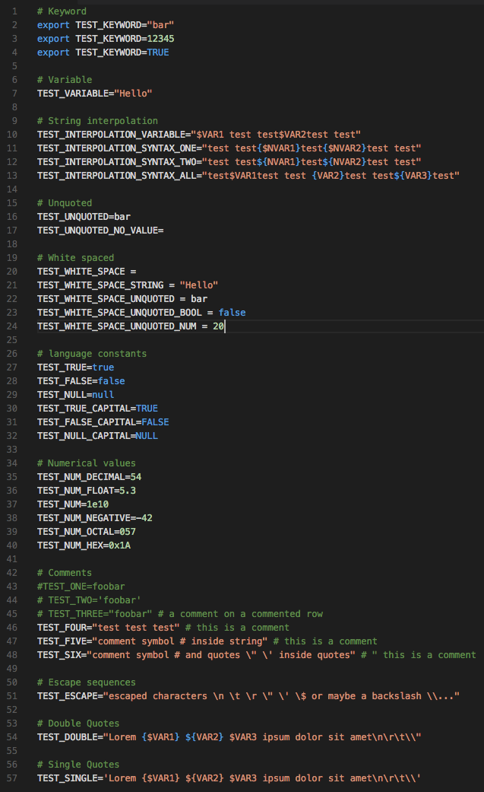

# VSCode .env syntax highlighting

A port of [DotENV](https://github.com/zaynali53/DotENV) for vscode.



### Associate files

If you use specific .env file naming convention (e.g. `.env.jenkins`) you can add dotenv support by setting the `files.associations` setting key as following :

```json
"files.associations": {
    ".env.jenkins": "dotenv"
 }
 ```
 
 Now, files with name `.env.jenkins` will be handled as dotenv file.

### Acknowledgements

- [Zayn Ali](https://github.com/zaynali53) for [DotENV](https://github.com/zaynali53/DotENV)
- [motdotla](https://github.com/motdotla/dotenv) for the logo
